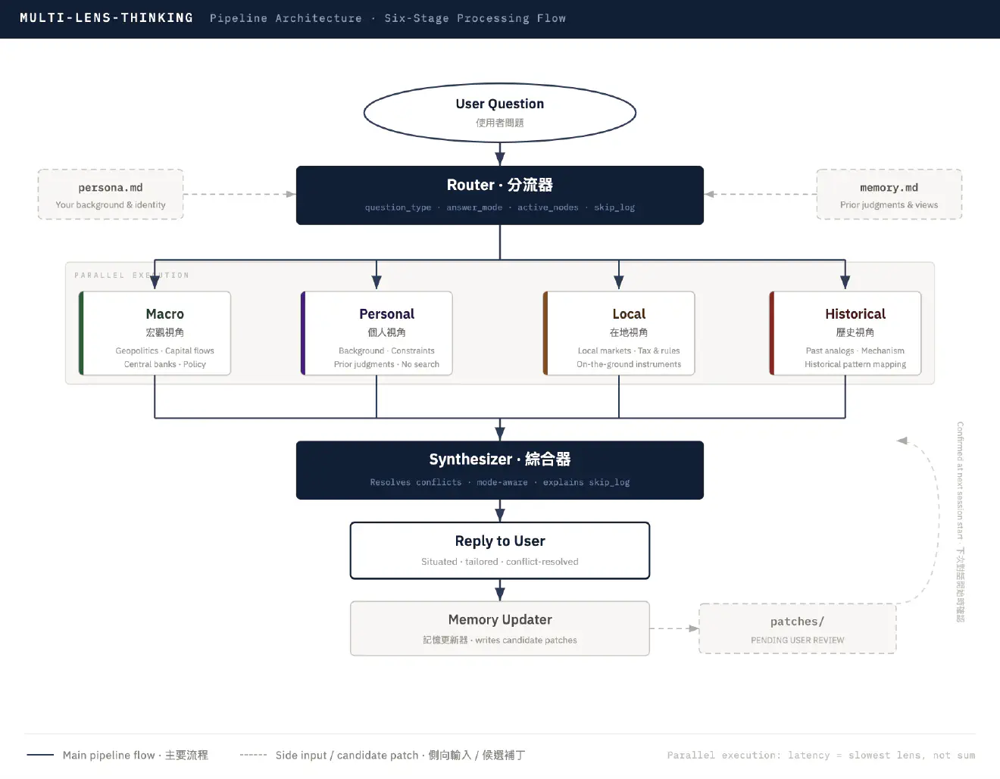

# multi-lens-thinking

<p align="center">
  
</p>

<h2 align="center">MLT —— Multi-Lens Thinking</h2>

<p align="center">
  English | <a href="README.CN.md">中文</a>
</p>

<p align="center">
  
  
  
  
</p>

> **Same question. Four lenses. One answer written only for you.**

Split the question across four independent lenses — **Macro · Personal · Local · Historical** — let them think in parallel, then synthesize a single answer that's *actually about you*.

No more "impressive the first time, hollow the tenth" generic AI answers.


---

### What it does for you

When you're asking questions like:

- "Should I switch to ___ job / city / role right now?"
- "Where does ___ industry / asset / policy land in the next 3 years?"
- "Is ___ opportunity actually a fit for *my* situation?"

A generic AI gives you the answer written for the median reader.
**multi-lens-thinking gives you the answer written for *you*.**

| What it does | What you get |
|--------------|--------------|
| **Splits perspectives** | Four lenses in parallel — Macro (geopolitics & capital) · Personal (your background) · Local (your on-the-ground reality) · Historical (mechanism analog) |
| **Prevents bleeding** | Each lens runs in its own context — no cross-contamination, no compromise mush |
| **Surfaces conflicts** | When lenses disagree, it shows you both sides and explains the weighting — instead of papering it into a "balanced" sentence |
| **Remembers honestly** | Each session drafts a candidate memory patch you approve item-by-item next session — no auto-poisoning of your context |

---

### How to use it (three steps)

**1. Install and tell it who you are**

```bash
git clone https://github.com/<your-username>/multi-lens-thinking ~/.claude/skills/multi-lens-thinking
cd ~/.claude/skills/multi-lens-thinking
cp templates/persona.md persona.md
cp templates/memory.md  memory.md
# Edit persona.md to reflect who you actually are:
# location, profession, decision style, current positions / constraints.
```

`persona.md` and `memory.md` are gitignored — only the templates ship in the public repo, your real content stays local.

**2. Just ask**

```
Analyze the most likely path of gold over the next three years
given today's geopolitics and macro.
```

The skill auto-triggers based on its description. To invoke explicitly, prefix with `用多維度分析` or `/multi-lens-thinking`.

**Optional**: install [anysearch-skill](https://github.com/anysearch-ai/anysearch-skill) as the Local lens's fallback for vertical search (jobs, real estate, local news) when WebSearch returns thin results.

**3. Review memory next session**

At the start of the next session, the skill surfaces the previous candidate patch and asks **approve / reject / edit — per item, not per file**. Rejected items are logged so the system stops proposing them.

---

### Worked example — gold 2026-2029 outlook

**You ask**:

> "Based on today's (May 2026) geopolitical risk and macro economy, analyze the most likely path of gold over the next three years. Fact- and data-driven."

**Four lenses run in parallel** (compressed):

| Lens | Key insight |
|------|-------------|
| **Macro** | Three forces stack: non-price-sensitive central bank buying (WGC Q1'26 net 244t) + unsustainable US fiscal path (CBO FY26 deficit $1.9T / 5.8% GDP) + BRICS Unit settlement layer going gold-backed → base case USD 5,500–7,000 / oz, CAGR 12–18%. |
| **Personal** | Voice tuning only (analytical mode). Register: formal-analytical, mechanism-over-narrative. Forbidden: hedge-everything filler, vague trend-words. |
| **Local** | AUD/USD 0.69–0.73 (RBA 4.35% hawkish hold) → AUD-gold return is 20–30% lower than USD-gold return. Cleanest ASX leverage: EVN (net cash position) > NST (production cut + Elliott activist pressure). |
| **Historical** | Strongest analog is **1971–1980** (Bretton Woods break + reserve weaponization), **NOT** 2001–2011 QE bull. Implication: structural uptrend, but expect at least one **25–35% mid-cycle drawdown** (cf. 1974–76 −40%). |

**The final answer you actually see**:

> **Base case**: structural bull market through 2029, USD target range **5,500–7,000 / oz** (CAGR 12–18%). Path is not monotonic — expect at least one 25–35% mid-cycle drawdown. For AUD-denominated investors, RBA's hawkish hold compresses the actual return by 20–30%; the cleanest leverage is ASX gold miners with cost-discipline (EVN > NST).
>
> *Three falsification signals*: (1) PBOC reported holdings jump to 5,000+ tonnes (2) Western ETF positioning returns to 2020 highs (3) 30-year TIPS yield breaks 2.5% while gold still prints highs.
>
> *I would be wrong if*: Fed forced into YCC + orderly USD devaluation + geopolitical de-escalation — central bank pace slows 30–40%, the move compresses back to a cyclical bounce.

Notice the answer never gives you "the median-reader version" — it knows you're in Sydney, you're AUD-denominated, the relevant instruments for you are ASX miners. That's the "written for you" difference.

---

### Why it works this way

The problem with generic AI isn't that it's "not smart enough." It's **architecture**.

You ask about gold. The model is asked to simultaneously: run macro analysis, find historical analogs, capture local reality, and respect all your personal constraints — all stuffed into one prompt. The result is **frames bleeding into each other**: the macro section starts thinking in AUD when it should stay in USD; the historical analog drifts toward your risk tolerance instead of staying disciplined on the mechanism. The answer *feels* personalized but is actually a compromise of every frame at once.

The naive fix is to stuff in more context. That makes the problem worse.

multi-lens-thinking's design premise is one sentence: **run each analytical dimension as its own sub-agent in its own context, then synthesize.** Macro thinks only macro, history thinks only history, the personal lens only ensures the answer respects you — none of them bleed. The Synthesizer receives four clean outputs, surfaces real disagreements explicitly, and shows you the weighting — instead of papering them over with "on balance…"

---

### How it works

```
Question
  ↓
[Router]  ← reads persona.md + memory.md once
  output: { question_type, answer_mode, user_snapshot,
            search_hints, active_nodes, skip_log }
  ↓
  ├─ Macro       (geopolitics & capital flow)   → WebSearch
  ├─ Personal    (your background)                (no search)
  ├─ Local       (on-the-ground reality)        → WebSearch / anysearch
  └─ Historical  (mechanism analog from past)   → WebSearch + LLM
  ↓
[Synthesizer]  ← four lens outputs + answer_mode + user_snapshot + skip_log
  ↓
Reply to user
  ↓
[Memory Updater] → patches/YYYYMMDD-HHMMSS.md   (confirmed next session)
```

The **Router** reads your `persona.md` + `memory.md` once and decides two things:

- **which lenses to activate** — *skip aggressively; most questions don't need all four*
- **which `answer_mode` to emit** — `analytical` / `personal_decision` / `framework` / `meta`

Four lenses then run **in parallel** (latency = slowest lens, not the sum):

| Lens | What it sees | Searches? |
|------|--------------|-----------|
| **Macro** | Geopolitics, capital flows, central-bank behavior, monetary regime | Yes (web) |
| **Personal** | Your background, constraints, prior judgments | No — reads you, not the world |
| **Local** | On-the-ground reality in your geography: prices, regulations, instruments, tax | Yes (web / anysearch) |
| **Historical** | The analog from the past that explains the present *mechanism* — not just surface similarity | Yes (web + LLM) |

The **Synthesizer** receives all four outputs plus the Router's mode and resolves conflicts explicitly.

**One failure mode worth naming.** An analyst asks *"analyze gold"* — and the model, having read their profession, returns a writing brief instead of analysis. The fix: `answer_mode` is determined by the **question verb**, not your identity. *"Analyze gold"* always emits `analytical` mode, even if you're a professional writer. Personal lens in `analytical` mode shrinks to voice-calibration only; the Synthesizer is explicitly forbidden from "you should write a piece on this" meta-commentary.

---

### A memory loop that stays honest

```
session N         → Memory Updater → patches/YYYYMMDD-HHMMSS.md  (candidate)
                                              ↓
session N+1 Step 0 → "approve / reject / edit?" → memory.md (merged on approve)
```

After each session, the Memory Updater writes a **candidate patch** — proposed additions to `memory.md`. You review at the start of the next session: approve / reject / edit per item. Rejected items are logged so the system stops proposing them.

This is **deliberately slow**. Auto-updating memory drifts; a few weeks of AI sessions can quietly poison what the model thinks it knows about you. The patch-and-confirm loop keeps you in control of what the system learns — without forcing you to maintain a context file after every conversation.

Your `persona.md` and `memory.md` stay on your machine. The public repo ships only the pipeline logic.

---

### File layout

```
multi-lens-thinking/
├── SKILL.md              ← skill manifest + execution procedure
├── README.md             ← this file
├── README.CN.md          ← Chinese version
├── LICENSE
├── .gitignore            ← excludes persona.md, memory.md, patches/
├── persona.md            ← YOUR persona — gitignored, copied from templates/
├── memory.md             ← YOUR memory — gitignored, copied from templates/
├── prompts/
│   ├── 01-router.md
│   ├── 02-macro.md
│   ├── 03-personal.md
│   ├── 04-local.md
│   ├── 05-historical.md
│   ├── 06-synthesizer.md
│   └── 07-memory-updater.md
├── templates/
│   ├── persona.md        ← generic structural template
│   └── memory.md         ← generic structural template
└── patches/              ← generated patches awaiting your confirmation
    └── .gitkeep
```

---

### Cost / latency expectations

| Scenario | Latency | Tokens |
|----------|---------|--------|
| Full 4-lens run with search | ~30–60s | ~8–20k |
| Skip-heavy (1–2 lenses active) | ~10–20s | ~2–6k |
| Router-only (no lens worth running) | ~3s | ~1k |

The Router's skip-aggressively rule is intentional: most "is X a good idea?" questions don't need a historical analog, and most how-to questions don't need any lens at all.

---

### Customizing

- **Change a lens prompt**: edit `prompts/02-*.md` through `prompts/05-*.md`. Each is self-contained.
- **Add a new lens**: add `prompts/0N-<name>.md`, update `SKILL.md`'s pipeline overview and the Router's `active_nodes` enum, then add the new node to `06-synthesizer.md`'s input list.
- **Tighten / loosen skipping**: edit the "Decision rules for active_nodes" section of `prompts/01-router.md`.
- **Change the voice of the final answer**: edit `prompts/06-synthesizer.md` → "Language" section.

---

### Publishing your fork

This skill is designed to be safe to fork. Your real `persona.md` / `memory.md` stay on your machine — only the generic templates ship.

```bash
cd ~/.claude/skills/multi-lens-thinking
git init
git add .
git status                                   # verify persona.md / memory.md are NOT staged
git commit -m "Initial commit"
git remote add origin git@github.com:<you>/multi-lens-thinking.git
git push -u origin main
```

If you ever accidentally commit `persona.md`, treat it as a credential leak — rewrite history with `git filter-repo` or delete the repo and start fresh.

---

### Known limits

- Sub-agents have isolated context; they don't see your prior conversation turns. If a question depends on history, include it in the question.
- WebSearch quality varies by topic. Macro is the most search-dependent; for very specialized topics, anysearch's vertical search helps.
- The Memory Updater is conservative by design. If you want a fact remembered immediately, edit `memory.md` directly — no patch dance.
- Cost scales linearly with lens count. Specific questions trigger more aggressive Router skipping.

---

### License

MIT. See `LICENSE`.
